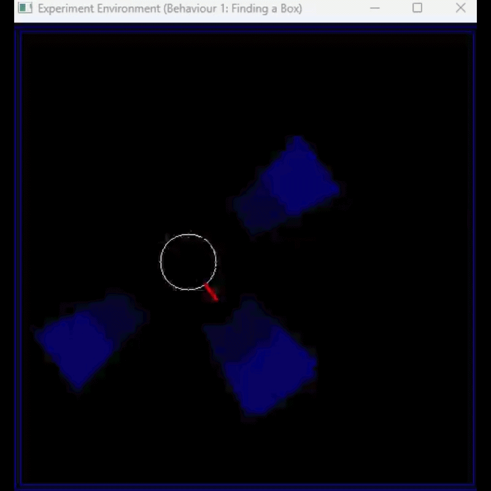
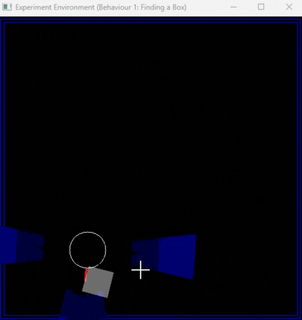
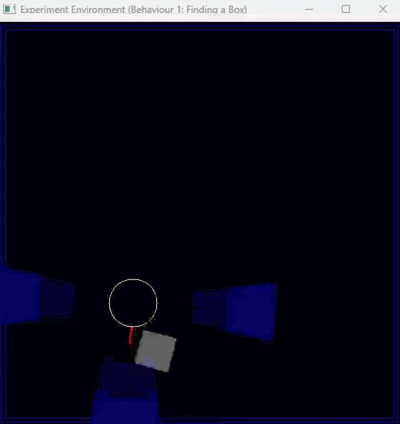

# OBELIX Robot Simulator: RL-based Behavior Control


**Picture:** *The figure shows the OBELIX robot examining a box, taken from the paper ["Automatic Programming of Behaviour-based Robots using Reinforcement Learning"](https://cdn.aaai.org/AAAI/1991/AAAI91-120.pdf)*

## Project Overview

This repository implements a comprehensive reinforcement learning framework for training and evaluating agents to control the OBELIX behavior-based robot. The project is based on the seminal paper ["Automatic Programming of Behaviour-based Robots using Reinforcement Learning"](https://cdn.aaai.org/AAAI/1991/AAAI91-120.pdf) by Sridhar Mahadevan and Jonathan Connell. The code is written in Python and uses the [OpenCV](https://docs.opencv.org/4.x/) library for the GUI.

The OBELIX robot's task is to navigate the environment and locate and attach to a box. The implementation includes multiple RL algorithms with varying complexity, allowing for comparison and benchmarking across different approaches.

**Course Context:** *This repo is used for practicing RL algorithms covered during the NPTEL's course [Reinforcement Learning](https://onlinecourses.nptel.ac.in/noc19_cs55/preview) 2023.*

**Adapted from:** https://github.com/iabhinavjoshi/OBELIX

---

## 📋 Detailed Project Report

For a comprehensive analysis of the project methodology, approaches, challenges, and solutions, please refer to the full project report:

**[CS780 Capstone Project: OBELIX - The Warehouse Robot](./CS780-OBELIX-Magesvar-V-R-251010068-report.pdf)**

The report includes:
- Problem formulation & environment description
- All RL algorithms attempted (DDQN, PPO, LSTM variants, etc.)
- Key design decisions & model evolution
- Reward shaping strategies
- Curriculum learning approaches
- Experimental results & benchmarks
- Error analysis & discussion

---

## 🎥 Demo Videos

### PPO Agent - Difficulty 3

| Success | Failure |
|---------|---------|
| **PPO: Successfully finds and attaches to box** <br/>  | **PPO: Failure - Gets stuck against walls** <br/>  |

### DQN Agent - Difficulty 3

| Success | Failure |
|---------|---------|
| **DQN: Successfully completes the task** <br/>  | **DQN: Failure - Suboptimal strategy** <br/>  |

---

## Manual Gameplay

The game can be played manually by executing the `manual_play.py` file. The robot is controlled by the user using the keyboard. The following keys are used to control the robot:

| Key | Action |
| --- | --- |
| `w` | Move forward |
| `a` | Turn left (45 degrees) |
| `q` | Turn left (22.5 degrees) |
| `e` | Turn right (22.5 degrees) |
| `d` | Turn right (45 degrees) |

## Getting Started

### Installation

```bash
pip install -r requirements.txt
```

### Dependencies & Libraries

This project uses the following Python libraries:

| Library | Purpose |
| --- | --- |
| **PyTorch** (`torch`, `torch.nn`, `torch.optim`) | Deep learning framework for implementing neural networks and RL algorithms |
| **NumPy** (`numpy`) | Numerical computing and array operations |
| **OpenCV** (`cv2`) | Computer vision and GUI rendering for environment visualization |
| **Python Standard Library** | `os`, `argparse`, `random`, `typing`, `json` - utility and file handling |

**Python Version:** 3.7+

### Playing Manually

```bash
python manual_play.py
```

### Training an Agent

Example: Train a PPO agent
```bash
python Training_code/train_ppo.py
```

### Evaluating an Agent

```bash
python evaluate.py --agent_file Agents/ppo_agent.py --runs 10 --seed 0 --max_steps 1000 --difficulty 0
```

## Automatic Gameplay

The robot can be controlled automatically using the reinforcement learning algorithm described in the paper. The algorithm is implemented in the `robot.py` file. The algorithm is run by executing the `robot.py` file. The following command can be used to run the algorithm:

```python 
import argparse
import cv2

import numpy as np

from obelix import OBELIX


bot = OBELIX(scaling_factor=5)
move_choice = ['L45', 'L22', 'FW', 'R22', 'R45']
user_input_choice = [ord("q"), ord("a"), ord("w"), ord("d"), ord("e")]
bot.render_frame()
episode_reward = 0
for step in range(1, 2000):
    random_step = np.random.choice(user_input_choice, 1, p=[0.05, 0.1, 0.7, 0.1, 0.05])[0]
    # # random_step = np.random.choice(user_input_choice, 1, p=[0.2, 0.2, 0.2, 0.2, 0.2])[0]
    if x in user_input_choice:
        x = move_choice[user_input_choice.index(x)]
        sensor_feedback, reward, done = bot.step(x)
        episode_reward += reward
        print(step, sensor_feedback, episode_reward)
```

## Scope of Improvement

In the current implementation, the push feature explained in the paper is not implemented properly and the current push is more of an attach feature i.e. once the robot finds the box and gets attached to it, the box sticks to the robot and moves along with it. 

## Reinforcement Learning Algorithms

This project implements and compares multiple RL algorithms to train agents for the OBELIX robot:

### Algorithms Implemented

| Algorithm | File | Description |
| --- | --- | --- |
| **PPO** | `ppo_agent.py` | Proximal Policy Optimization - baseline policy gradient approach |
| **PPO with LSTM** | `lstmppo_agent.py`, `ppo_lstm_agent.py` | PPO combined with LSTM memory for sequence modeling |
| **PPO with Heuristics** | `ppo_heuristic.py` | PPO enhanced with domain knowledge and heuristics |
| **PPO with RS (Reward Shaping)** | `ppo_rs_agent.py` | PPO with reward shaping techniques |
| **DQN** | `agent_ddqn.py` | Deep Q-Network approach for value-based learning |
| **RSSM** | `rssm_agent.py` | Recurrent State Space Model for world modeling |
| **FSM PPO** | `fsm_ppo_agent.py` | Finite State Machine combined with PPO |

## Scoring + Evaluation (Leaderboard)

The environment now supports a simple, reproducible scoring setup:

- **Success condition:** once the robot attaches to the box, the episode ends when the **attached box touches the boundary** (terminal bonus).
- **Evaluation:** run the agent for a fixed number of steps, repeat for multiple random seeds, and report the mean/std score.

### Submission Template

Edit [agent_template.py](agent_template.py) or [submission_template1.py](submission_template1.py)/[submission_template2.py](submission_template2.py) and implement:

```python
def policy(obs, rng) -> str:
    ...
```

Valid actions are: `L45`, `L22`, `FW`, `R22`, `R45`.

### Running Evaluation

Example (10 runs, averaged):

```bash
python evaluate.py --agent_file agent_template.py --runs 10 --seed 0 --max_steps 1000 --wall_obstacles
```

Difficulty knobs:

- `--difficulty 0`: static box
- `--difficulty 1`: harder variants
- `--difficulty 2`: blinking / appearing-disappearing box
- `--difficulty 3`: moving + blinking box
- `--box_speed N`: moving box speed (for `--difficulty >= 3`)

This appends a row to `leaderboard.csv`.

## Benchmarking Results

Fill in the following table with results for each algorithm across different difficulty levels. Metrics: Mean episode reward ± Std Dev (format: `X.XX ± Y.YY`).

| Algorithm | Difficulty 0 (Static) | Difficulty 1 | Difficulty 2 (Blinking) | Difficulty 3 (Moving+Blinking) | Notes |
| --- | --- | --- | --- | --- | --- |
| PPO | -1981.2 | -1991.2 | — | — | |
| PPO + LSTM | -1991.0 | -1992.8 | — | — | |
| **PPO + Heuristics** | -1800.1 | — | — | 1845.78  | |
| DDQN | -1883.6 | —  | — | 835.6 | |
| **Best Overall** | -1800.1 | — | — | 1845.78 | |

## Project Structure

```
CS780-OBELIX/
├── obelix.py                           # Main OBELIX environment simulator
├── agent_template.py                   # Template for implementing custom agents
├── evaluate.py                         # Evaluation script for leaderboard
├── manual_play.py                      # Manual control interface
├── leaderboard.csv                     # Benchmarking results log
│
├── Agents/                             # Trained agents
│   ├── ppo_agent.py                   # Standard PPO agent
│   ├── lstmppo_agent.py               # PPO with LSTM
│   ├── ppo_lstm_agent.py              # Alternative LSTM PPO
│   ├── ppo_heuristic.py               # PPO with heuristics
│   ├── ppo_rs_agent.py                # PPO with reward shaping
│   ├── agent_ddqn.py                  # DQN agent
│   ├── rssm_agent.py                  # RSSM agent
│   └── fsm_ppo_agent.py               # FSM + PPO agent
│
├── Training_code/                      # Training scripts for each algorithm
│   ├── train_ppo.py
│   ├── train_lstm_ppo.py
│   ├── train_mod1_ppo.py
│   ├── train_ppo_rs.py
│   ├── train_ddqn_new1.py
│   ├── train_rssm_ppo.py
│   └── ...
│
├── Weights/                            # Saved model weights
│   ├── weights_ppo.pth
│   ├── weights_ppo_rs.pth
│   ├── weights_ddqn.pth
│   ├── weights_rssm_ppo.pth
│   └── ...
│
└── Plots/                              # Visualization and analysis

```

## References

- [CS780 Capstone Project Report - Full Details](./CS780-OBELIX-Magesvar-V-R-251010068-report.pdf)
- [Automatic Programming of Behaviour-based Robots using Reinforcement Learning](https://cdn.aaai.org/AAAI/1991/AAAI91-120.pdf) - Original OBELIX paper (Mahadevan & Connell, 1991)
- [OBELIX Repository](https://github.com/iabhinavjoshi/OBELIX) - Original repository
- [Proximal Policy Optimization Algorithms](https://arxiv.org/abs/1707.06347) - PPO paper
- [Asynchronous Methods for Deep Reinforcement Learning](https://arxiv.org/abs/1602.01783) - A3C/A2C methods
- [Deep Recurrent Q-Learning for Partially Observable MDPs](https://arxiv.org/abs/1507.06527) - LSTM-based RL

## Future Improvements

- [ ] Implement proper push feature (currently attach/carry)
- [ ] Add more complex environment dynamics
- [ ] Explore curriculum learning strategies
- [ ] Add real robot transfer learning capabilities
- [ ] Implement multi-agent scenarios
- [ ] Optimize for faster training convergence

